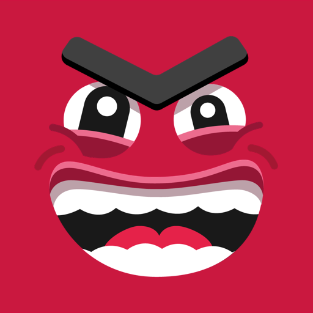
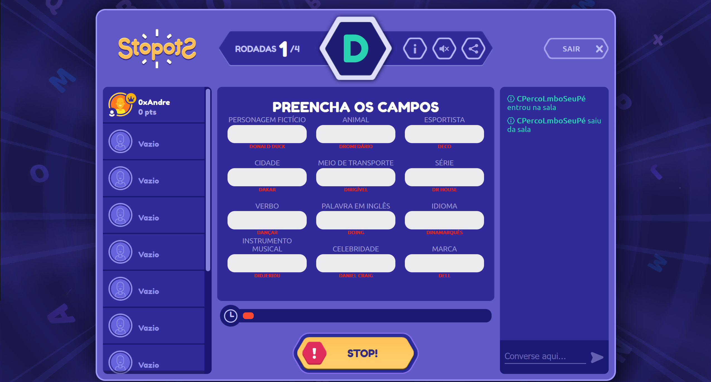

# GGStopotS



GGStopotS is a cheat to <a href="https://stopots.com">stopots.com</a> game. Is a browser extension that allows you to get the stopots game solutions. The project's objective is to learn more about modify the behavior of the browser or web pages loaded by the browser.

<p align="center" style="margin-top: 120px">
  
</p>

## Browser Compatibility
The extension only works in Firefox (tested @ 105.0.1). To run this extension e.g. in chrome, it's necessary to change the `browser` object to `chrome`:

from:
```js
browser.contextMenus.onClicked.addListener((info) => {
  language = info.menuItemId;

  browser.tabs
    .executeScript({
      file: "engine.js",
    })
    .then(onExecuted);
});

```

to: 

```js
browser.contextMenus.onClicked.addListener((info) => {
  language = info.menuItemId;

  chrome.tabs
    .executeScript({
      file: "engine.js",
    })
    .then(onExecuted);
});

```

> This change has not been tested!

## How it Works

1. Open Firefox and load the `about:debugging` page.
2.  Click [Load Temporary Add-on](https://developer.mozilla.org/en-US/Add-ons/WebExtensions/Temporary_Installation_in_Firefox) and select the `manifest.json`
3. Join StopotS game
4. Enjoy

<p align="center" style="margin-top: 120px">
  
</p>

## Contribute

Feel free to contribute. I'm updating the word list in Portuguese `words/words_pt.json`.

## Publish
This extension is not published, use `about:debugging`.

